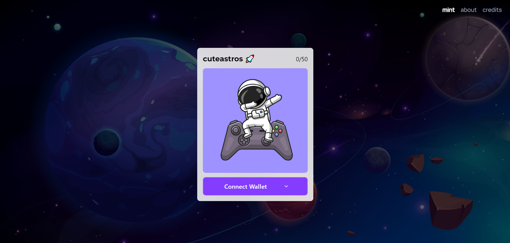

## NFT minting dapp 🚀
This is a NFT minting dapp built with next.js based on thirdweb.

#### Tech stack
React (Next.js)
Typescript
Ethers
Thirdweb


#### Installation

``` 
yarn install
```

#### Configuration
1. Create a NFT drop contract [thirdweb](https://thirdweb.com/)
2. Go to [index.tsx](pages/index.tsx)
3. Update your contract address at line 12
4. Go to [_app.tsx](pages/_app.tsx)
3. Update desired chain at line 6.

##### Thats it! now you can play around and customize the dapp!